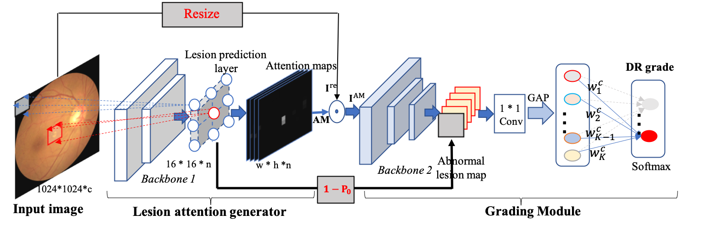
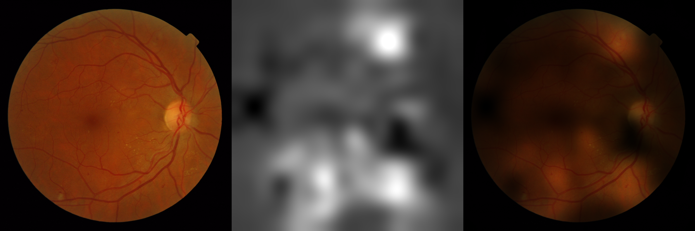

# CLPI: Robust Collaborative Learning of Patch-level and Image-level Annotations for Diabetic Retinopathy Grading from Fundus Image
In this paper, we present a robust framework, which can collaboratively utilize both patch-level lesion and image-level grade annotations, for DR severity grading. By end-to-end optimizing the entire framework, the fine-grained lesion and image-level grade information can be bidirectionally exchanged to exploit more discriminative features for DR grading. Compared with the recent state-of-the-art algorithms and three over 9-years clinical experience ophthalmologists, the proposed algorithm shows effective performance. Testing on the datasets from totally different label distributions and scenarios, our algorithm is proved robust in facing distribution and low image quality problems that is commonly exists in real world practice. Extensive experimental ablation studies dissect the proposed framework into parts, and reveal the effective and indispensable of each component.



# Requirements
    - PaddlePaddle-GPU >= 1.6.3
    - opencv-python 3.4.3.18
    - pandas 1.0.5
    - tabulate 0.8.7
    - scikit-learn (optional, for kappa evaluation)
 
# Preparation
For uncompressing model weights:
```
cd ./demo/
wget "https://bj.bcebos.com/v1/ai-studio-online/d419957a9b1a46358fc04235d2e67504c6971c46ed0641af90b1206dd98a6393?responseContentDisposition=attachment%3B%20filename%3Dmessidor_densenet_full_best.zip&authorization=bce-auth-v1%2F5cfe9a5e1454405eb2a975c43eace6ec%2F2022-10-31T02%3A20%3A31Z%2F-1%2F%2Fc451fb52f231a9f54a61a747458680f75bddc8241f539eb95d0ac27eb2bd1e9f" -O messidor_densenet_full_best.zip
tar zxvf messidor_densenet_binary_full_best.tar.gz

cd ../
```

# Inference
### Create infer file (see demo/infer_file_demo.csv)
Write relative path of images start from `./demo/`
```
demo/images/20051213_62648_0100_PP.png
demo/images/20051021_59136_0100_PP.png
demo/images/20051214_40719_0100_PP.png
demo/images/20051205_31994_0400_PP.png
```

### Put images into `./demo/images/`
Due to the limitation of the size of the images, we can not upload unmodified images from Messidor-2, please download Messidor-2 dataset and put the four images listed above into `./demo/images/`.

### Run inference
```
FLAGS_fraction_of_gpu_memory_to_use=0.1 \
FLAGS_eager_delete_tensor_gb=1 \
CUDA_VISIBLE_DEVICES=0 \
python3 -u inference.py \
        -a DenseNet121 \
        --resume-from demo/messidor_densenet_full_best/ \
        --infer-file='./demo/infer_file_demo.csv' --infer-classdim=5
```

A pandas dataframe will be displayed like this:

|                                        |   pred |
|:---------------------------------------|-------:|
| demo/images/20051213_62648_0100_PP.png |      4 |
| demo/images/20051021_59136_0100_PP.png |      2 |
| demo/images/20051214_40719_0100_PP.png |      1 |
| demo/images/20051205_31994_0400_PP.png |      2 |

### Evaluation
You might modify `main() @ inference.py` to obtain the dataframe named `prediction`, 
then concatenate DR Label from `Messidor-2` by file name.

And evaluate `kappa score`:
```
from sklearn.metrics import cohen_kappa_score
kappa_score = cohen_kappa_score(..., weights="quadratic")
```

# CAM
For acquire CAM(class activation heatmaps):
```
FLAGS_fraction_of_gpu_memory_to_use=0.1 \
FLAGS_eager_delete_tensor_gb=1 \
CUDA_VISIBLE_DEVICES=0 \
python3 -u get_cam_heatmap.py \
        -a DenseNet121 \
        --resume-from demo/messidor_densenet_full_best/ \
        --infer-file='./demo/infer_file_demo.csv' \
        --infer-classdim=5
```

### Visualization


# Appendix
- For reproducible, we provide our train / validation / test split on Messidor-2 following `6 / 2 / 2`, because of the lack of official test set. Please refer to `demo/partition/`

# Citation
If you use CLPI in your research, please cite our work by using the following BibTeX entry:
```latex
@ARTICLE{yang2021robust,
    author={Yang, Yehui and Shang, Fangxin and Wu, Binghong and Yang, Dalu and Wang, Lei and Xu, Yanwu and Zhang, Wensheng and Zhang, Tianzhu},
    journal={IEEE Transactions on Cybernetics}, 
    title={Robust Collaborative Learning of Patch-Level and Image-Level Annotations for Diabetic Retinopathy Grading From Fundus Image}, 
    year={2021},
    volume={},
    number={},
    pages={1-11},
    doi={10.1109/TCYB.2021.3062638}
}

@inproceedings{yang2017lesion,
    author = {Yang, Yehui and Li, Tao and Li, Wensi and Wu, Haishan and Fan, Wei and Zhang, Wensheng},
    year = {2017},
    month = {09},
    pages = {533-540},
    title = {Lesion Detection and Grading of Diabetic Retinopathy via Two-Stages Deep Convolutional Neural Networks},
    booktitle = {Medical Image Computing and Computer Assisted Intervention {MICCAI}},
    isbn = {978-3-319-66178-0},
    doi = {10.1007/978-3-319-66179-7_61}
}
```
