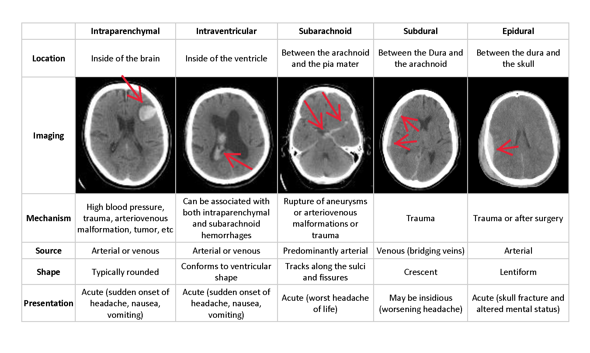
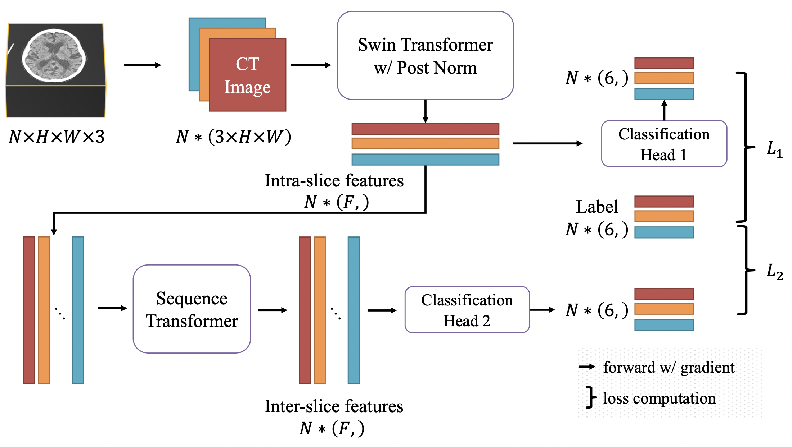

# An Effective Transformer-based Solution for RSNA Intracranial Hemorrhage Detection Competition

[[Arxiv](https://arxiv.org/abs/2205.07556)] [[AIStudio](https://aistudio.baidu.com/aistudio/projectdetail/4032049)]

# Background

Intracranial hemorrhage, bleeding that occurs inside the cranium, is a serious health problem requiring rapid and often intensive medical treatment. Intracranial hemorrhages account for approximately 10% of strokes in the U.S., where stroke is the fifth-leading cause of death. Identifying the location and type of any hemorrhage present is a critical step in treating the patient.



In 2019, a competition was held by Radiological Society of North America(RSNA), which encourages to develop automatic algorithm for intracranial hemorrhage detection (IHD). The automatic multi- label classification algorithms were expected to determine whether there exists intracranial hemorrhage in each 2D slice of the input CT scan and output a probability vector with six elements. Specifically, according to bleeding location, there are 5-categories of the hemorrhage need to detect, epidural(EDH), intraparenchymal(IPH), intraventricular(IVH), subarachnoid(SAH), subdural(SDH) with an overall indicator to indicate there is any hemorrhage in the slice. The performance of the solution is evaluated by the weighted multi-label logarithmic loss (log-loss).

# Method

In this paper, we proposed an intracranial hemorrhage detection algorithm that outperforms the first place solution by a single model (0.04368 vs 0.04383). The intra-slice and inter-slice feature extractor are integrated into one model with the end-to-end manner, which avoid cumulative errors. Moreover, to reduce the amount of the ensemble models, we introduced the recently proposed semi-supervised learning method which take the test-samples into the training set and improve the performance. Some open issues still exist, including more precisely detecting hemorrhages and extending our solution to other slice- wise applications. We release the source code and hope that other researchers will achieve more breakthroughs.



# Requirements
- PaddlePaddle-GPU >= 2.2.0
- opencv-python >= 4.5.5
- pandas == 1.3.4
- scikit-learn == 1.0.1
- SimpleITK == 2.0.2
- PyYAML == 5.4.1

# Train & Infer
see `script/brain_ih_clas.sh` for details.


## Preparation
For uncompressing model weights:

```shell
mkdir ./model_zoo/ && cd ./model_zoo/

wget "https://bj.bcebos.com/v1/ai-studio-online/01bf9a847d2b4e86a285b2e729dafb6c280aad1224eb468bba27f029cfbac336?responseContentDisposition=attachment%3B%20filename%3Dbrain_ihd.tar.gz&authorization=bce-auth-v1%2F0ef6765c1e494918bc0d4c3ca3e5c6d1%2F2022-04-07T07%3A18%3A25Z%2F-1%2F%2F2eedf53628e35452d059aeed44c268d45a495105fab519dee5f446e821a311ee" -O brain_ihd.tar.gz # ~ 1.07GB

tar zxvf brain_ihd.tar.gz # ~ 1Gb
rm brain_ihd.tar.gz
```

## Infer
```shell
python3 -u -m paddle.distributed.launch infer.py \
        --config config/brain_intracranial_hemorrhage_clas_sequential.yml \
        --num_workers 4 \
        --infer_splition test \
        --resume_model ./model_zoo/0.04368_rank1/model.pdparams \
        --multigpu_infer
```


# Citation
If you use our work in your research, please cite our work by using the following BibTeX entry:

```
@misc{2205.07556,
Author = {Fangxin Shang and Siqi Wang and Yehui Yang},
Title = {An Effective Transformer-based Solution for RSNA Intracranial Hemorrhage Detection Competition},
Year = {2022},
Eprint = {arXiv:2205.07556},
}
```
