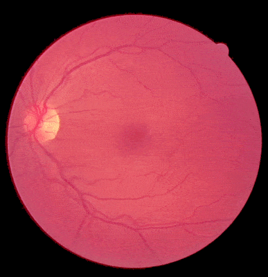

#Two data augmentation methods for roubst retinal fundus images analysis

======================================================

##Introduction

### This repository has the source code for the paper "Robust retinal vessel segmentation from a data augmentation perspective" .

- **Channel-wise random gamma correction**

- **Channel-wise random vessel augmentation**

We provide the implementation of the proposed data augmentation methods, namely, channel-wise random gamma correction and channel-wise random vessel augmentation. You may run the **data\_augmentation\_demo** notebook to see how these two methods work. 

Since the vessel segmentation model could be easily trained based on the [PaddleSeg](https://github.com/PaddlePaddle/PaddleSeg) library, here we only show how the exported **PaddlePaddle** inference model (trained on the DRIVE training set using the proposed data augmentation methods) could be used for segmenting real-world retinal fundus images. Interested readers could refer to the **vessel\_segmentation\_demo.py** file for details.

##Configuration

This code has been tested on python3.6 environment with the folloing site-packages:

    matplotlib==2.2.2
    numpy==1.16.4
    opencv-python==3.4.3
    paddlepaddle-gpu==1.6.2
    
To execute the vessel segmentation demo, you should download the inference model weights [here](https://pan.baidu.com/s/1PrA0KyYNamfm9UrDO3nLVA) (fetch code: 63kp), and put them into the pdl_assets directory.
After that, run the following scripts:

    python vessel_segmentation_demo.py

##Citation request

If you find this code useful in your research, please consider citing our paper.