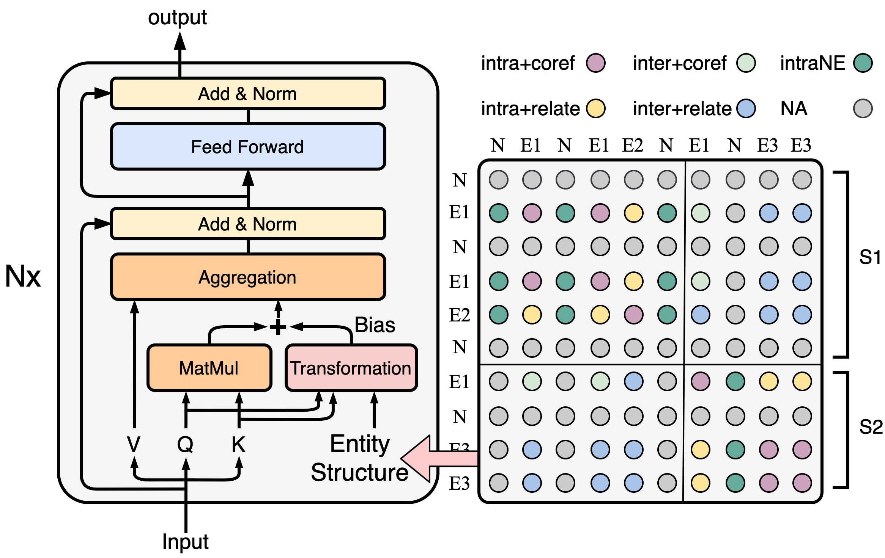

# SSAN
## Introduction
This is the [PaddlePaddle](https://www.paddlepaddle.org.cn/) implementation of the **SSAN** model (see our AAAI2021 paper: [Entity Structure Within and Throughout: Modeling Mention Dependencies
for Document-Level Relation Extraction](https://arxiv.org/abs/2102.10249)).  
[ERNIE repo](https://github.com/PaddlePaddle/ERNIE)
**SSAN (Structured Self-Attention Network)** is a novel extension of Transformer to effectively incorporate structural dependencies between input elements.
And in the scenerio of document-level relation extraction, we consider the **structure of entities**.
<div  align="center">  

</div>  
Specificly, we propose a transformation module, that produces attentive biases based on the structure prior so as to adaptively regularize the attention flow within and throughout the encoding stage.
We achieve SOTA results on several document-level relation extraction tasks.  
This implementation is adapted based on [ERNIE repo](https://github.com/PaddlePaddle/ERNIE), you can find the main revision for SSAN model in [./model/SSAN_encoder.py#L123-L150](./model/SSAN_encoder.py#L123-L150).
You can also find our pytorch implementation in [here](https://github.com/BenfengXu/SSAN).


## Requirements
 * python3.7, paddlepaddle-gpu==1.6.3.post107, dataclasses  
 * This implementation is tested on a single 32G V100 GPU with CUDA version=10.2 and Driver version=440.33.01.


## Prepare Model and Dataset
Download pretrained ERNIE model.
```
cd ./pretrained_lm/
wget https://ernie.bj.bcebos.com/ERNIE_Base_en_stable-2.0.0.tar.gz
mkdir -p ./ernie2_base_en && tar -zxvf ERNIE_Base_en_stable-2.0.0.tar.gz -C ./ernie2_base_en
wget https://ernie.bj.bcebos.com/ERNIE_Large_en_stable-2.0.0.tar.gz
mkdir -p ./ernie2_large_en && tar -zxvf ERNIE_Large_en_stable-2.0.0.tar.gz -C ./ernie2_large_en
```
Download [DocRED dataset](https://drive.google.com/drive/folders/1c5-0YwnoJx8NS6CV2f-NoTHR__BdkNqw) into `./data`, including `train_annotated.json`, `dev.json` and `test.json`.


## Train
```
sh train.sh
```
Train and eval SSAN. Model will be saved in `./checkpoints`, and the best threshold for relation prediction will be searched on dev set when evaluation.  
By default you are running **SSAN based on ERNIE Base**, set `--with_ent_structure` to `false` and the model will fall back to **ERNIE Base Baseline**.
If you want to train ERNIE Large models, just set model path to `./pretrained_lm/ernie2_large_en`.


## Predict
```
sh predict.sh
```
Set your checkpoint directory and threshold for prediction. The result will be saved as `./data/result.json`.  
You can compress and upload it to the official competition leaderboard at [CodaLab](https://competitions.codalab.org/competitions/20717#results).
```
cd ./data/
zip result.zip result.json
```

## Results
Results on DocRED datasets:

|Model | Dev F1 | Test Ign F1| Test F1 |
|---|---|---|---|
|ERNIE Base Baseline | 58.54 | 55.58 | 57.71 |
|SSAN<sub>Biaffine</sub> | 59.12(+0.58) | 57.07(+1.49) | 59.05(+1.34) |
|ERNIE Large Baseline | 60.25 | 57.87 | 60.11 |
|SSAN<sub>Biaffine</sub> | 61.58(+1.33) | 58.96(+1.09) | 61.17(+1.06) |

We set learning rate = 3e-5, batch size = 4, and search for the best epochs among (40, 60, 80, 100) on development set.


## Citation (Arxiv version, waiting for the official proceeding.)
If you use any source code included in this project in your work, please cite the following paper:
```
@misc{xu2021entity,
      title={Entity Structure Within and Throughout: Modeling Mention Dependencies for Document-Level Relation Extraction}, 
      author={Benfeng Xu and Quan Wang and Yajuan Lyu and Yong Zhu and Zhendong Mao},
      year={2021},
      eprint={2102.10249},
      archivePrefix={arXiv},
      primaryClass={cs.CL}
}
```


## Copyright and License
Copyright 2021 Baidu.com, Inc. All Rights Reserved Licensed under the Apache License, Version 2.0 (the "License"); you may not use this file except in compliance with the License.
You may obtain a copy of the License at http://www.apache.org/licenses/LICENSE-2.0 Unless required by applicable law or agreed to in writing, software distributed under the License is distributed on an "AS IS" BASIS, WITHOUT WARRANTIES OR CONDITIONS OF ANY KIND, either express or implied.
See the License for the specific language governing permissions and limitations under the License.
