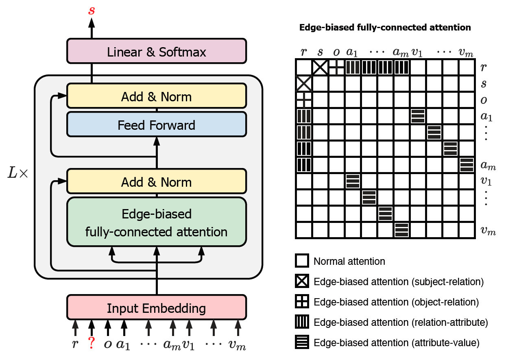

# GRAN: A Graph-based Approach to N-ary Relational Learning
## Introduction

This is the [PaddlePaddle](https://www.paddlepaddle.org.cn/) implementation of GRAN, a graph-based neural network architecture for learning and reasoning with n-ary relational data. The overall framework of GRAN is given as follows:

<p align="center">
 <br />
Overall Framework of GRAN
</p>

This repository contains the code and data, as well as the optimal configurations to reproduce the reported results.


## Requirements
This project should work fine with the following environments:
- Python 2.7.15 for data preprocessing
- Python 3.6.5 for training & evaluation with:
    -  PaddlePaddle 1.5.0
    -  numpy 1.16.3
- GPU with CUDA 9.0, CuDNN v7, and NCCL 2.3.7

All the experiments are conducted on a single 16G V100 GPU.


## How to Run

### Step 1. Download raw data
We consider two representative n-ary relational datasets:
- [JF17K](https://dl.acm.org/doi/pdf/10.1145/3178876.3186017)
- [WikiPeople](https://dl.acm.org/doi/pdf/10.1145/3308558.3313414)

Besides, we consider four subsets of them, consisting solely of 3-ary or 4-ary relational facts:
- [JF17K-3](https://dl.acm.org/doi/pdf/10.1145/3366423.3380188)
- [JF17K-4](https://dl.acm.org/doi/pdf/10.1145/3366423.3380188)
- [WikiPeople-3](https://dl.acm.org/doi/pdf/10.1145/3366423.3380188)
- [WikiPeople-4](https://dl.acm.org/doi/pdf/10.1145/3366423.3380188)

We provid a convenient script to download all the datasets and organize them into a directory named `raw`. Please run:

```
sh download_data.sh
```

The datasets can also be downloaded from:
- JF17K: https://github.com/lijp12/SIR/tree/master/JF17k/JF17k-simple/version1
- WikiPeople: https://github.com/gsp2014/NaLP/tree/master/data/WikiPeople
- JF17K-3, JF17K-4, WikiPeople-3, WikiPeople-4: https://github.com/liuyuaa/GETD/tree/master/Nary%20code/data

### Step 2. Preprocess data
Then we convert the raw data into the required format for training and evaluation. The new data is organized into a directory named `data`, with a sub-directory for each dataset. In general, a sub-directory contains:
- `train.json`: train set
- `valid.json`: dev set
- `test.json`: test set
- `all.json`: combination of train/dev/test sets, used only for *filtered* evaluation
- `vocab.txt`: vocabulary consisting of entities, relations, and special tokens like [MASK] and [PAD]

> Note: JF17K is the only one that provides no dev set.

The statistics of the datasets are summarized as follows:

| Dataset | #Entity | #Relation | #Train | #Dev | #Test | Arity |
|:---|---:|---:|---:|---:|---:|:---:|
| JF17K                  | 28,645 | 501 | 76,379  | -      | 24,568 | 2-6 |
| WikiPeople             | 47,765 | 193 | 305,725 | 38,223 | 38,281 | 2-9 |
| WikiPeople<sup>-</sup> | 34,825 | 178 | 294,439 | 37,715 | 37,712 | 2-7 |
| JF17K-3 | 11,541 | 208 | 27,635 | 3,454 | 3,455  | 3 |
| JF17K-4 | 6,536  | 69  | 7,607  | 951   | 951    | 4 |
| WikiPeople-3 | 12,270 | 112 | 20,656  | 2,582  | 2,582  | 3 |
| WikiPeople-4 | 9,528  | 95  | 12,150  | 1,519  | 1,519  | 4 |

We also provid a convenient script for data preproessing. Please run:

```
sh preprocess_data.sh
```

This script takes as input the raw data and generates new data in the required format, with data statisitcs given.

### Step 3. Training & Evaluation

To train and evaluate the GRAN model, please run:

```
sh run.sh [Config_File] [GPU_ID]
```

Here `[Config_File]` is the path to a configuration file and `[GPU_ID]` the GPU ID. Take JF17K as an example. To train and evalute on this dataset, please run:

```
sh run.sh ./configs/jf17k_config.sh 0
```

On all the datasets, we simply fix GRAN to the same model size:
- 12 graph attention layers
- 4 attention heads
- hidden size 256
- intermediate size 512

And we always train with:
- batch size 1024
- learning rate 5e-4

The following hyperparameters are tunable, tuned in their respective ranges:
- entity soft label from 0.1 to 1.0 in steps of 0.1
- relation soft label from 0.5 to 1.0 in steps of 0.1
- dropout rate from 0.1 to 0.5 in steps of 0.1
- training epochs from 20 to 200 in steps of 20

The optimal settings for these tunable hyperparameters on each dataset are provided in `[Config_File]`.


## Reproducing the Results

The following results are expected with the default settings (varying within 1%).

**Predicting All Entities**

|Dataset | MRR | HITS@1 | HITS@3 | HITS@5 | HITS@10 |
|:---|:---:|:---:|:---:|:---:|:---:|
|JF17K        | 0.656 | 0.582 | 0.693 | 0.740 | 0.799 |
|JF17K-3      | 0.806 | 0.759 | 0.834 | 0.862 | 0.896 |
|JF17K-4      | 0.852 | 0.801 | 0.890 | 0.917 | 0.939 |
|WikiPeople   | 0.479 | 0.410 | 0.514 | 0.553 | 0.604 |
|WikiPeople-3 | 0.416 | 0.325 | 0.452 | 0.518 | 0.608 |
|WikiPeople-4 | 0.431 | 0.309 | 0.520 | 0.578 | 0.642 |

**Predicting Subject/Object**

|Dataset | MRR | HITS@1 | HITS@3 | HITS@5 | HITS@10 |
|:---|:---:|:---:|:---:|:---:|:---:|
|JF17K                  | 0.617 | 0.539 | 0.654 | 0.705 | 0.770 |
|WikiPeople<sup>-</sup> | 0.503 | 0.438 | 0.536 | 0.572 | 0.620 |


## BibTex

When using this codebase please cite:
```
@inproceedings{wang2021:gran,
    title = {Link Prediction on N-ary Relational Facts: A Graph-based Approach},
    author = {Wang, Quan and Wang, Haifeng and Lyu, Yajuan and Zhu, Yong},
    booktitle = {Findings of ACL 2021},
    year = {2021},
}
```


## Copyright and License

Copyright 2021 Baidu.com, Inc. All Rights Reserved Licensed under the Apache License, Version 2.0 (the "License"); you may not use this file except in compliance with the License. You may obtain a copy of the License at http://www.apache.org/licenses/LICENSE-2.0 Unless required by applicable law or agreed to in writing, software distributed under the License is distributed on an "AS IS" BASIS, WITHOUT WARRANTIES OR CONDITIONS OF ANY KIND, either express or implied. See the License for the specific language governing permissions and limitations under the License.
