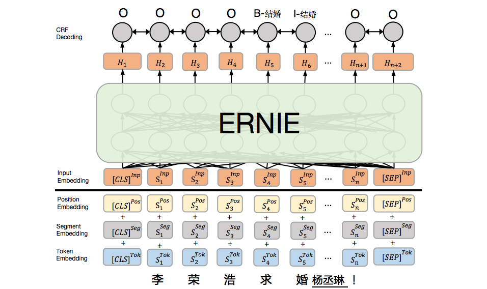
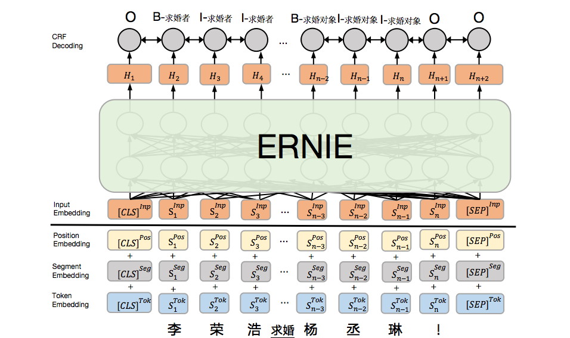

English | [简体中文](./README.zh.md)

# Event Extraction Baseline model (EE-Baseline)

EE-Baseline is a event extraction baseline model for the event extraction dataset DuEE 1.0. This model splits event extraction into two sub-tasks: trigger extraction and argument extraction, solved as two sequence labeling problems in a pipelined fashion.

#### Trigger extraction model based on sequence labeling (Tri-SeqL)

Trigger extraction aims to predict whether a token triggers an event. We formulates trigger extraction as a sequence labeling problem with labels indicate the event types. This model is built upon a pre-trained language model ERNIE combined with a CRF layer.

<div align="center">

</div>

> For above example, the model recognizes the trigger "求婚" and assigns it to the label "B-结婚" "I-结婚", finally, we get event type is "结婚"。

#### Argument extraction model based on Sequence labeling (Arg-SeqL)

Argument extraction aims to extract arguments and corresponding argument roles they play. We formulates argument extraction as a sequence labeling problem with labels indicate the argument roles. This model is also built upon a pre-trained language model ERNIE combined with a CRF layer.

<div align="center">

</div>

> For above example,  the model recognizes the arguments: 1) "李荣浩", assigns it labels "B-求婚者"、"I-求婚者" "I-求婚者"; 2) "杨丞琳", assigns it labels "B-求婚对象" "I-求婚对象" "I-求婚对象". Finally, we get argument roles and argument pairs is <求婚者, 李荣浩> <求婚对象, 杨丞琳>.


## Getting Started

### Environment Requirements

- python 2.7.x
- paddlepaddle-gpu >= 1.5.0 (see more details about PaddlePaddle [PaddlePaddle Homepage](https://www.paddlepaddle.org.cn/install/quick))

The code is tested on a single GPU Tesla K40m, with CUDA version=10.1, GPU Driver Version=418.39.

###### Install dependencies

```
pip install -r ./requirements.txt
```

### Integration steps

##### Step 1: Data preparation

Including steps Download pre-trained ERNIE model、Examples process and Schmea process

```shell
sh bin/script/data_preparation.sh
```

Re-executing this step requires deleting files `./model/ERNIE_1.0_max-len-512.tar.gz`、`./data/train.json`、`./data/dev.json`、`./data/test.json`、`./dict/vocab_trigger_label_map.txt`、`./dict/vocab_roles_label_map.txt`

##### Step 2: Train and results process

Including steps train and predict results of Tri-SeqL、train and predict results of Arg-SeqL、Prediction results process.

```shell
sh bin/script/train_and_eval.sh
```

Re-executing this step requires deleting files `./save_model/trigger`、`./save_model/role`、 `./save_model/trigger/pred_trigger.json` and `./save_model/role/pred_role.json`.

### Detailed steps

##### Step 1: Download pre-trained ERNIE model

```shell
cd ./model
wget https://ernie.bj.bcebos.com/ERNIE_1.0_max-len-512.tar.gz --no-check-certificate
mkdir ERNIE_1.0_max-len-512
tar -zxvf ERNIE_1.0_max-len-512.tar.gz -C ERNIE_1.0_max-len-512
```
Download ERNIE1.0 Base（max-len-512）model and extract it into `./model/ERNIE_1.0_max-len-512/`


##### Step 2: Examples process


Process examples into `./data/`, create files `train.json`、`dev.json` and `test.json`

```python
python bin/data_process.py origin_events_process ./data/eet_events.json ./data/
```

##### Step 3: Schmea process

- Trigger label process for Tri-SeqL and save file into `./dict/vocab_trigger_label_map.txt`

```python
python bin/data_process.py schema_event_type_process ./dict/event_schema.json ./dict/vocab_trigger_label_map.txt
```

- Argument Role Label for Arg-SeqL and save file into `./dict/vocab_roles_label_map.txt`

```python
python bin/data_process.py schema_role_process ./dict/event_schema.json ./dict/vocab_roles_label_map.txt
```

##### Step 4: Train Tri-SeqL

```shell
cd ./bin
HERE=$(readlink -f "$(dirname "$0")")
cd ${HERE}/..
DATA_DIR=${HERE}/../../data
PRETRAIN_MODEL=${HERE}/../../model/ERNIE_1.0_max-len-512
SAVE_MODEL=${HERE}/../../save_model
DICT=${HERE}/../../dict
GPUID=0
TRIGGER_SAVE_MODEL=${SAVE_MODEL}/trigger

sh script/train_event_trigger.sh ${GPUID} ${DATA_DIR} ${TRIGGER_SAVE_MODEL} ${PRETRAIN_MODEL} ${DICT}

```

##### Step 5: Prediction Tri-SeqL

```shell
cd ./bin
HERE=$(readlink -f "$(dirname "$0")")
cd ${HERE}/..
DATA_DIR=${HERE}/../../data
PRETRAIN_MODEL=${HERE}/../../model/ERNIE_1.0_max-len-512
SAVE_MODEL=${HERE}/../../save_model
DICT=${HERE}/../../dict
GPUID=0
TRIGGER_SAVE_MODEL=${SAVE_MODEL}/trigger

sh script/predict_event_trigger.sh ${GPUID} ${DATA_DIR} ${PRETRAIN_MODEL} ${TRIGGER_SAVE_MODEL}/final_model ${DICT}
```

##### Step 6: Train Arg-SeqL

```shell
cd ./bin
HERE=$(readlink -f "$(dirname "$0")")
cd ${HERE}/..
DATA_DIR=${HERE}/../../data
PRETRAIN_MODEL=${HERE}/../../model/ERNIE_1.0_max-len-512
SAVE_MODEL=${HERE}/../../save_model
DICT=${HERE}/../../dict
GPUID=0
ROLE_SAVE_MODEL=${SAVE_MODEL}/role

sh script/train_event_role.sh ${GPUID} ${DATA_DIR} ${ROLE_SAVE_MODEL} ${PRETRAIN_MODEL} ${DICT}
```

##### Step 7: Prediction Arg-SeqL

```shell
cd ./bin
HERE=$(readlink -f "$(dirname "$0")")
cd ${HERE}/..
DATA_DIR=${HERE}/../../data
PRETRAIN_MODEL=${HERE}/../../model/ERNIE_1.0_max-len-512
SAVE_MODEL=${HERE}/../../save_model
DICT=${HERE}/../../dict
GPUID=0
ROLE_SAVE_MODEL=${SAVE_MODEL}/role

sh script/predict_event_role.sh ${GPUID} ${DATA_DIR} ${PRETRAIN_MODEL} ${ROLE_SAVE_MODEL}/final_model ${DICT}
```

##### step 8: Prediction results process

- Transform test set（`./data/test.json`）to evaluation format file `./result/gold.json`

```python
python bin/predict_eval_process.py test_data_2_eval ./data/test.json ./result/gold.json
```

- Integrate and transform prediction results into evaluation format

Integrate predict results file of Tri-SeqL（`./save_model/trigger/pred_trigger.json`）、predict results file of Arg-SeqL（`./save_model/role/pred_role.json`）、events schema file（`./dict/event_schema.json`）into  evaluation format file `./result/pred.json`

```python
python bin/predict_eval_process.py predict_data_2_eval ./save_model/trigger/pred_trigger.json ./save_model/role/pred_role.json ./dict/event_schema.json ./result/pred.json
```

# Evaluation

Zip your prediction json (`./result/pred.json`) file and submit it to official website

## Discussion

If you have any question, you can submit an issue in github and we will respond periodically.
