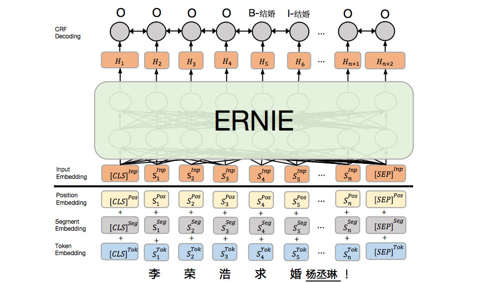
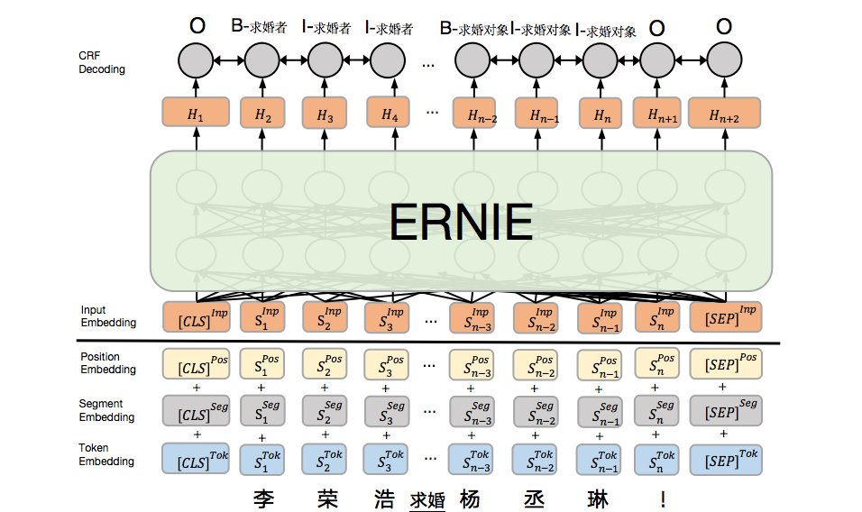

[English](./README.md) | 简体中文

# 事件抽取基线模型 (EE-Baseline)

EE-Baseline是在事件抽取数据集（DuEE 1.0）上进行事件抽取的基线模型，该模型采用基于[ERNIE](https://github.com/PaddlePaddle/ERNIE)的序列标注（sequence labeling）方案，分为基于序列标注的触发词抽取模型和基于序列标注的论元抽取模型，属于PipeLine模型；基于序列标注的触发词抽取模型采用BIO方式，识别触发词的位置以及对应的事件类型，基于序列标注的论元抽取模型采用BIO方式识别出事件中的论元以及对应的论元角色。

#### 基于序列标注的触发词抽取模型

基于序列标注的触发词抽取模型是整体模型的一部分，该部分主要是给定事件类型，识别句子中出现的事件触发词对应的位置以及对应的事件类别，该模型是基于ERNIE开发序列标注模型，采用ERNIE+CRF实现，模型原理图如下：

<div align="center">

</div>

> 上述样例中模型通过模型识别出触发词"求婚"，并分配给"B-结婚"、"I-结婚"标签，最终可以得到该句子中包含 “结婚”事件类型。

#### 基于序列标注的论元抽取模型

基于序列标注的论元抽取模型也是整体模型的一部分，该部分主要是识别出事件中的论元以及对应论元角色，该模型是基于ERNIE开发序列标注模型，采用ERNIE+CRF实现，模型原理图如下：

<div align="center">

</div>

> 上述样例中通过模型识别出：1）论元"李荣浩"，并分配标签"B-求婚者"、"I-求婚者"、"I-求婚者"；2）论元"杨丞琳", 并分配标签"B-求婚对象"、"I-求婚对象"、"I-求婚对象"。最终识别出句子中包含的论元角色和论元对是<求婚者，李荣浩>、<求婚对象，杨丞琳>

#### 抽取结果处理策略

根据触发词抽取模型识别到的事件类型对应的所有论元角色关联论元抽取模型的结果，得到最终模型的输出结果


## 快速开始

### 环境需求

- python适用版本 2.7.x（本代码测试时使用依赖见 `./requirements.txt` ）
- paddlepaddle-gpu >= 1.5.0 请转至[paddlepaddle官网](https://www.paddlepaddle.org.cn/install/quick)按需求安装对应版本的paddlepaddle

代码测试于单卡GPU Tesla K40m，CUDA版本 10.1，GPU Driver版本 418.39

###### 依赖安装

```
pip install -r ./requirements.txt
```

### 集成步骤

##### 步骤1：训练数据处理

包括下载预训练模型、数据处理成模型读入格式、处理事件schema生成触发词抽取模型和论元抽取模型需要的标签文档，对应详细步骤中的步骤1-3

```shell
sh bin/script/data_preparation.sh
```
重新执行需要删除部分文件（ `./model/ERNIE_1.0_max-len-512.tar.gz`、`./data/train.json`、`./data/dev.json`、`./data/test.json`、`./dict/vocab_trigger_label_map.txt`、`./dict/vocab_roles_label_map.txt`）否则相应的处理过程将不执行

##### 步骤2: 模型训练与结果处理

包括触发词抽取模型的训练和预测过程、论元抽取模型的训练和预测过程、预测结果处理，对应详细步骤中的步骤4-8

```shell
sh bin/script/train_and_eval.sh
```

重新训练两个模型需要删除 `./save_model/trigger` 和 `./save_model/role` ，重新预测结果需要删除 `./save_model/trigger/pred_trigger.json` 和 `./save_model/role/pred_role.json`

### 详细步骤

##### 步骤1: 下载ERNIE预训练模型

```shell
cd ./model  # 所有模型保存目录
wget https://ernie.bj.bcebos.com/ERNIE_1.0_max-len-512.tar.gz --no-check-certificate
mkdir ERNIE_1.0_max-len-512  # ernie模型保存目录
tar -zxvf ERNIE_1.0_max-len-512.tar.gz -C ERNIE_1.0_max-len-512
```

在 `./model/ERNIE_1.0_max-len-512/` 目录下保存了预训练模型的参数文件目录( `params/`)、词汇表(`vocab.txt`)、模型配置(`ernie_config.json`)

##### 步骤2: 处理样本数据

将原始格式的数据处理成模型读入所需要的格式，并随机划分训练集（80%）和测试集（20%），在 `./data/` 目录下创建 `train.json`、`dev.json`、`test.json` 文件

```python
python bin/data_process.py origin_events_process ./data/eet_events.json ./data/
```

##### 步骤3: 处理schema生成序列标注标签文档

- 触发词抽取模型标签，保存到文件 `./dict/vocab_trigger_label_map.txt`

```python
python bin/data_process.py schema_event_type_process ./dict/event_schema.json ./dict/vocab_trigger_label_map.txt
```

- 论元抽取模型标签，保存到文件 `./dict/vocab_roles_label_map.txt`

```python
python bin/data_process.py schema_role_process ./dict/event_schema.json ./dict/vocab_roles_label_map.txt
```

##### 步骤4: 训练触发词抽取模型

训练完成创建 `./save_model/trigger/final_model` 文件夹保存最终模型参数，每500步保存训练过程参数，测试集预测结果保存在 `./save_model/trigger/pred_trigger.json`

```shell
cd ./bin
HERE=$(readlink -f "$(dirname "$0")")
cd ${HERE}/..
DATA_DIR=${HERE}/../../data
PRETRAIN_MODEL=${HERE}/../../model/ERNIE_1.0_max-len-512
SAVE_MODEL=${HERE}/../../save_model
DICT=${HERE}/../../dict
GPUID=0
TRIGGER_SAVE_MODEL=${SAVE_MODEL}/trigger

sh script/train_event_trigger.sh ${GPUID} ${DATA_DIR} ${TRIGGER_SAVE_MODEL} ${PRETRAIN_MODEL} ${DICT}

```

##### 步骤5: 预测触发词结果

，测试集预测结果保存在 `./save_model/trigger/pred_trigger.json`

```shell
cd ./bin
HERE=$(readlink -f "$(dirname "$0")")
cd ${HERE}/..
DATA_DIR=${HERE}/../../data
PRETRAIN_MODEL=${HERE}/../../model/ERNIE_1.0_max-len-512
SAVE_MODEL=${HERE}/../../save_model
DICT=${HERE}/../../dict
GPUID=0
TRIGGER_SAVE_MODEL=${SAVE_MODEL}/trigger

sh script/predict_event_trigger.sh ${GPUID} ${DATA_DIR} ${PRETRAIN_MODEL} ${TRIGGER_SAVE_MODEL}/final_model ${DICT}
```

##### 步骤6: 训练论元抽取模型

训练完成创建 `./save_model/role/final_model` 文件夹保存最终模型参数，每500步保存训练过程参数，测试集预测结果保存在 `./save_model/role/pred_role.json`

```shell
cd ./bin
HERE=$(readlink -f "$(dirname "$0")")
cd ${HERE}/..
DATA_DIR=${HERE}/../../data
PRETRAIN_MODEL=${HERE}/../../model/ERNIE_1.0_max-len-512
SAVE_MODEL=${HERE}/../../save_model
DICT=${HERE}/../../dict
GPUID=0
ROLE_SAVE_MODEL=${SAVE_MODEL}/role

sh script/train_event_role.sh ${GPUID} ${DATA_DIR} ${ROLE_SAVE_MODEL} ${PRETRAIN_MODEL} ${DICT}
```

##### 步骤7: 预测论元角色结果

测试集预测结果保存在 `./save_model/role/pred_role.json`

```shell
cd ./bin
HERE=$(readlink -f "$(dirname "$0")")
cd ${HERE}/..
DATA_DIR=${HERE}/../../data
PRETRAIN_MODEL=${HERE}/../../model/ERNIE_1.0_max-len-512
SAVE_MODEL=${HERE}/../../save_model
DICT=${HERE}/../../dict
GPUID=0
ROLE_SAVE_MODEL=${SAVE_MODEL}/role

sh script/predict_event_role.sh ${GPUID} ${DATA_DIR} ${PRETRAIN_MODEL} ${ROLE_SAVE_MODEL}/final_model ${DICT}
```

##### 步骤8: 预测结果处理

- 将测试集（`./data/test.json`）转化为评估格式 `./result/gold.json`

```python
python bin/predict_eval_process.py test_data_2_eval ./data/test.json ./result/gold.json
```

- 将预测结果整合并转为评估格式

需要触发词预测结果（`./save_model/trigger/pred_trigger.json`）、论元角色预测结果（`./save_model/role/pred_role.json`）、事件schema文件（`./dict/event_schema.json`）,保存到预测结果文件 `./result/pred.json`

```python
python bin/predict_eval_process.py predict_data_2_eval ./save_model/trigger/pred_trigger.json ./save_model/role/pred_role.json ./dict/event_schema.json ./result/pred.json
```

- 效果评估

1）将预测结果转为的评估格式文件提交到事件抽取竞赛网站

2）实现评估方法，输入测试集和预测结果转化为评估格式的结果

## 测试

暂无

## 如何贡献

提交issue，然后提交patch，说明关联的issue

## 讨论

1）如果您有任何疑问，可以在issue中提交问题，我们将定期答复。
