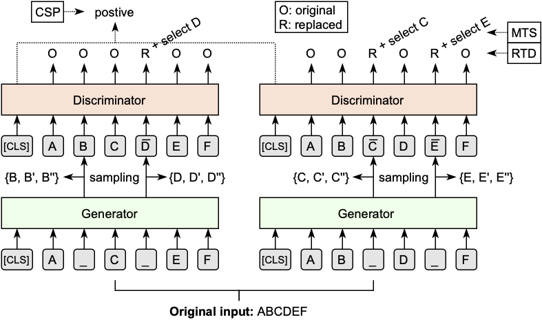

# Building Chinese Biomedical Language Models via Multi-Level Text Discrimination

This repo introduces **eHealth**, a Chinese biomedical language model pre-trained from in-domain text of de-identified online doctor-patient dialogues, electronic medical records, and textbooks.

eHealth is trained from scratch with a new self-supervised generator-discriminator framework. The generator is used to produce corrupted input and will be discarded after pre-training. The discriminator, which is the final target encoder, is trained via multi-level discrimination: (i) **token-level discrimination** that detects input tokens corrupted by the generator and selects original signals from plausible candidates; and (ii) **sequence-level discrimination** that further detects corruptions of a same original sequence from those of the others.

<p align="center">
 <br />
Overall Framework of eHealth
</p>


## Download

eHealth discriminator shares identical architecture with [ERNIE Base](https://github.com/PaddlePaddle/ERNIE/tree/repro/ernie/model), and can be simply employed by replacing the model file. Our pretrained checkpoint can be downloaded via the following link:
|                                             Model                                              | Supported Version |
|:----------------------------------------------------------------------------------------------:|:-----------------:|
| [eHealth-base-discriminator](https://paddlenlp.bj.bcebos.com/models/transformers/electra/eHealth-base-discriminator.tar) | PaddlePaddle 1.8  |


## Benchmarking

We provide eHealth's performance on [CBLUE](https://github.com/alibaba-research/ChineseBLUE) (Chinese Biomedical Language Understanding Evaluation) benchmark, which is composed of 8 diversified biomedical NLP tasks, ranging from medical text classification and matching to medical information extraction and medical term normalization.
| Model                 | CMeEE | CMeIE | CDN  | CTC  | STS  | QIC  | QTR  | QQR  |   Avg.   |
|:----------------------|:------|:-----:|:----:|:----:|:----:|:----:|:----:|:----:|:--------:|
| BERT-base             | 66.5  | 60.6  | 69.7 | 68.6 | 84.7 | 85.2 | 59.2 | 82.5 |   72.1   |
| ELECTRA-base          | 65.1  | 60.4  | 69.9 | 67.7 | 84.4 | 85.2 | 61.8 | 84.0 |   72.3   |
| MacBERT-base          | 66.8  | 61.5  | 69.7 | 69.1 | 84.4 | 86.0 | 61.0 | 83.5 |   72.7   |
| RoBERTa-wwm-ext-base  | 66.7  | 61.4  | 69.3 | 68.3 | 84.2 | 86.0 | 60.9 | 82.7 |   72.4   |
| ELECTRA-large         | 66.1  | 59.3  | 70.8 | 68.9 | 85.1 | 84.1 | 62.0 | 85.7 |   72.8   |
| MacBERT-large         | 67.6  | 62.2  | 70.9 | 69.7 | 86.5 | 85.7 | 62.5 | 83.5 |   73.6   |
| RoBERTa-wwm-ext-large | 67.3  | 62.2  | 70.6 | 70.6 | 85.4 | 86.7 | 61.7 | 86.1 |   73.8   |
| MC-BERT-base          | 66.6  | 60.7  | 70.1 | 69.1 | 85.4 | 85.3 | 61.6 | 82.3 |   72.6   |
| PCL-MedBERT-base      | 66.6  | 60.8  | 69.9 | 70.4 | 84.8 | 85.3 | 60.2 | 83.3 |   72.7   |
| eHealth-base          | 67.0  | 61.6  | 71.2 | 70.5 | 86.2 | 87.4 | 63.5 | 85.5 | **74.1** |


## BibTex

When use eHealth, please cite as:
```
ToDo
```

## Copyright and License

Copyright 2021 Baidu.com, Inc. All Rights Reserved Licensed under the Apache License, Version 2.0 (the "License"); you may not use this file except in compliance with the License. You may obtain a copy of the License at http://www.apache.org/licenses/LICENSE-2.0 Unless required by applicable law or agreed to in writing, software distributed under the License is distributed on an "AS IS" BASIS, WITHOUT WARRANTIES OR CONDITIONS OF ANY KIND, either express or implied. See the License for the specific language governing permissions and limitations under the License.
