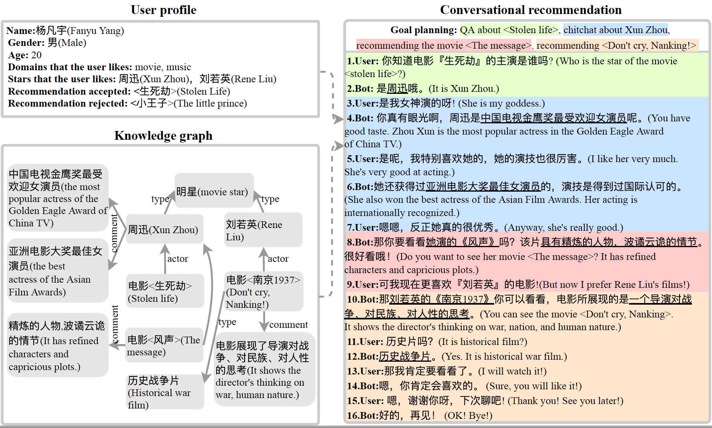

DuRecDial (Towards Conversational Recommendation over Multi-Type Dialogs)
=============================

We identify the task of **conversational recommendation over multi-type dialogs**. To facilitate the study of this task, we create a human-to-human **Rec**ommendation oriented multi-type Chinese **Dial**og dataset at Bai**Du** (**DuRecDial**). In **DuRecDial**, every dialog contains multi-type dialogs with natural topic transitions. Moreover, there are rich interaction variability for recommendation. In addition, each seeker has an explicit profile for the modeling of personalized recommendation, and multiple dialogs with the recommender to mimic real-world application scenarios. **DuRecDial** contains **multi-type** dialogs (Recommendation dialog, chitchat, Task-oriented dialogue and QA), **10.2K** conversations from **7** domains (movie, star, music, news, food, poi, and weather), and **156K** utterances. An example of DuRecDial:




Our paper (Towards Conversational Recommendation over Multi-Type Dialogs) on [arXiv](https://arxiv.org/abs/2005.03954) and [ACL Anthology](https://www.aclweb.org/anthology/2020.acl-main.98/). A Chinese intro & news for this paper is available [here](https://mp.weixin.qq.com/s/f3dCOc4Mog9eZTl0k5YQew). 

If the corpus is helpful to your research, please kindly cite our paper:

```
@inproceedings{Liu2020TowardsCR,
  title={Towards Conversational Recommendation over Multi-Type Dialogs},
  author={Z. Liu and H. Wang and Zheng-Yu Niu and Hua Wu and W. Che and Ting Liu},
  booktitle={ACL},
  year={2020}
}
```

# Dataset
The dataset is available at https://baidu-nlp.bj.bcebos.com/DuRecDial.zip. Each conversation looks like the following:
```python
{"kg": 
    [["沈阳", "2018-12-24", "晴, 西南风, 最高气温:2℃, 最低气温:-12℃"], 
    ["糖醋排骨", "成分", "猪肋排、姜片、葱、生抽、糖、醋、料酒、八角。"], 
    ["糖醋排骨", "类型", "热菜"], 
    ["晴, 西南风, 最高气温:2℃, 最低气温:-12℃", "适合吃", "糖醋排骨"], 
    ["大清花饺子（十一纬路店）", "特色菜", "糖醋排骨"], 
    ["大清花饺子（十一纬路店）", "评分", "4.8"], 
    ["大清花饺子（十一纬路店）", "人均价格", "50"], 
    ["大清花饺子（十一纬路店）", "地址", "沈河区十一纬路198号（近南二经街）"], 
    ["大清花饺子（十一纬路店）", "订单量", "1405"]], 
"user_profile": 
    {"职业状态": "工作", "同意的新闻": " 何炅 的新闻", "没有接受的音乐": [" 还有我", "心火烧"], "喜欢的音乐": " 另一个自己", "年龄区间": "大于50", "拒绝": " 电影", "喜欢的明星": " 何炅", "接受的音乐": [" 向前奔跑", "思念的距离", "我是大侦探", "希望爱", "现在爱", "再见", "一路走过"], "居住地": "沈阳", "喜欢的poi": " 大清花饺子（十一纬路店）", "姓名": "陈轩奇", "同意的美食": " 糖醋排骨", "性别": "男"}, 
"conversation": 
    ["[1]今天是什么天气？", 
    "今天沈阳: 晴, 西南风, 最高气温:2℃, 最低气温:-12℃，天气有点冷，注意保暖。", 
    "你知道的真多。", 
    "[2]这种天气温适合吃 『糖醋排骨』了呢。", 
    "糖醋排骨可是我最喜欢的美食，真想现在就去吃糖醋排骨呢。", 
    "[3]我正好知道有一家店，推荐您在 『大清花饺子（十一纬路店）』 订糖醋排骨。", 
    "这家店的地址在哪里？", 
    "这家店的地址：沈河区十一纬路198号（近南二经街）", 
    "人均价格是多少？", 
    "人均价格50元。", 
    "评分是多少？", 
    "评分是4.8", 
    "今天中午12点半我一个人去吃，我预定一下。", 
    "好的，这就为您预定。", 
    "[4]先去准备一下，再见", 
    "好的，再见，祝你生活愉快！"], 
"goals": 
    "[1]问天气(User主动，User问天气，根据给定知识，Bot回复完整的天气信息，User满足并好评)-->[2]美食推荐(Bot主动推荐，这种天气温适合吃 『糖醋排骨』, User接受。需要聊2轮)-->[3]poi推荐(Bot主动，Bot推荐在 『大清花饺子（十一纬路店）』 订 『糖醋排骨』, User问 『大清花饺子（十一纬路店）』 的『人均价格』、『地址』、『评分』，Bot逐一回答后，最终User接受并提供预订信息:『就餐时间』 和 『就餐人数』)-->[4]再见", 
"situation": 
    "聊天时间:2018-12-24 中午12:00，在公司 星期一"
    }
```

- `kg` provides all Background knowledge related to dialogue in the form of SPO..

- `user_profile` includes some personal information, domain preference and entity preference of users.

- `goals` contains the dialog topic transfer path of dialog session.

- `situation` includes the time, place and topic of the dialogue.

- `conversation` is a list of all the turns in the dialogue.


# Model
Due to some problems in the internal process, the model cannot be open source for the time being. As an alternative, you can use the baseline model of the [LIC 2020 competition](https://github.com/PaddlePaddle/Research/tree/master/NLP/Conversational-Recommendation-BASELINE).


# Competitions
We hold ___competitions___ to encourage more researchers to work in this direction.

* [Conversational Recommendation Task](https://aistudio.baidu.com/aistudio/competition/detail/29) in [2020 Language and Intelligence Challenge](http://lic2020.cipsc.org.cn/).

* [LUGE: Chit-chat Task](https://aistudio.baidu.com/aistudio/competition/detail/48/) in [LUGE ( Language Understanding and Generation Evaluation Benchmarks )](https://www.luge.ai/).

* [AISTUDIO LUGE: Multi-skill Dialogue Task](https://aistudio.baidu.com/aistudio/competition/detail/55) and [DF LUGE: Multi-skill Dialogue Task](https://www.datafountain.cn/competitions/470).


If the corpus is helpful to your research, please kindly cite our paper:

```
@inproceedings{Liu2020TowardsCR,
  title={Towards Conversational Recommendation over Multi-Type Dialogs},
  author={Z. Liu and H. Wang and Zheng-Yu Niu and Hua Wu and W. Che and Ting Liu},
  booktitle={ACL},
  year={2020}
}
```