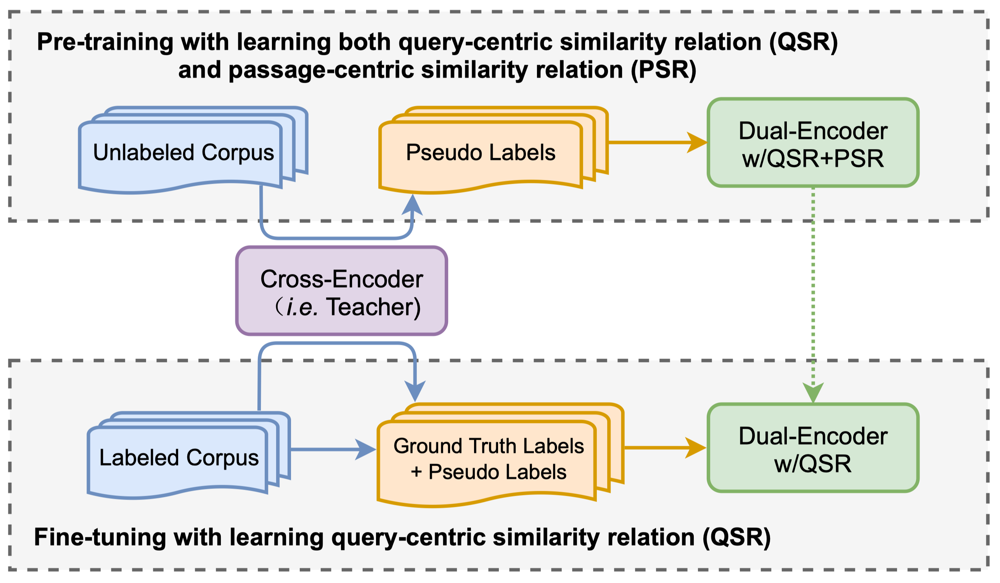

# PAIR
This is a repository of the paper: [PAIR: Leveraging Passage-Centric Similarity Relation for Improving Dense Passage Retrieval](https://aclanthology.org/2021.findings-acl.191/), ACL 2021. 

## Introduction
PAIR is a novel approach to improving dense passage retrieval. The three major technical contributions include introducing formal formulations of the two kinds of similarity relations, generating high-quality pseudo labeled data via knowledge distillation, and designing an effective two-stage training procedure that incorporates passage-centric similarity relation constraint.
The experiment results show that PAIR significantly outperforms previous state-of-the-art models on both MSMARCO and Natural Questions (NQ).  

The pipeline of PAIR training approach is shown as follows:


## Preparation
### Environment
* Python 3.7
* PaddlePaddle 1.8 (Please refer to the [Installation Guide](http://www.paddlepaddle.org/#quick-start)) 
* cuda >= 9.0  
* cudnn >= 7.0
* faiss
### Download data
To download the raw corpus of MSMARCO & Natural Questions, as well as the preprocessed training data, run
```
sh wget_data.sh
```
The downloaded data will be saved into <u>`corpus`</u> (including the training and development/test sets of MSMARCO & NQ and all the passages in MSMARCO and Wikipedia to be indexed), <u>`data_train`</u> (including the preprocessed training data for pre-training and fine-tuning of PAIR).
```
├── corpus/
│   ├── marco                   # The original dataset of MSMARCO 
│   │   ├── train.query.txt
│   │   ├── train.query.txt.format
│   │   ├── qrels.train.tsv
│   │   ├── dev.query.txt
│   │   ├── dev.query.txt.format
│   │   ├── qrels.dev.tsv
│   │   ├── para.txt
│   │   ├── para.title.txt
│   │   ├── para_8part          # The paragraphs were divided into 8 parts to facilitate the inference
│   │   ├── 
│   ├── nq                      # The original dataset of NQ 
│   │   ├── ...                 # (has the same directory structure as MSMARCO) 
```

```
├── data_train/
│   ├── marco_pretrain.tsv                   # Training examples for pre-training stage, positives and negatives of hybrid-domain queries are pseudo labels sampled by knowledge distillation from MSMARCO corpus
│   ├── marco_finetune.tsv                   # Training examples for fine-tuning stage, positives and negatives of in-domain queries are ground truth labels and pseudo labels sampled by knowledge distillation from MSMARCO corpus
│   ├── nq_pretrain.tsv                      # Training examples for pre-training stage, positives and negatives of hybrid-domain queries are pseudo labels sampled by knowledge distillation from Wikipedia corpus
│   ├── nq_finetune.tsv                      # Training examples for fine-tuning stage, positives and negatives of in-domain queries are ground truth labels and pseudo labels sampled by knowledge distillation from Wikipedia corpus
```
### Download the trained models
To download our trained models and the initial pre-trained language model (ERNIE 2.0), run
```
sh wget_trained_model.sh
```
The downloaded model parameters will be saved into <u>`checkpoint`</u>, including
```
├── checkpoint/   
│   ├── ernie_base_twin_init                    # (ERNIE 2.0 base) initial parameters for dual-encoder
│   ├── marco_finetuned_encoder                 # Final dual-encoder model with shared parameters on MSMARCO
│   ├── nq_finetuned_encoder                    # Final dual-encoder model with shared parameters on NQ
```


## Training


### The Training Procedure
To reproduce the results of the paper, you can follow the commands in **```run_marco.sh```** / **```run_nq.sh```**. These scripts contain the entire process of PAIR. Each step depends on the result of the previous step. 

### Running command for each stage

#### Dual-encoder pre-training
To pre-train a dual-encoder model, run
```
cd model
sh script/run_dual_encoder_train.sh $TRAIN_SET $MODEL_PATH $nodes $use_cross_batch $use_lamb true
```

#### Dual-encoder fine-tuning
To fine-tune a dual-encoder model, run
```
cd model
sh script/run_dual_encoder_train.sh $TRAIN_SET $MODEL_PATH $nodes $use_cross_batch $use_lamb false
```

#### Dual-encoder inference
To do the inference of dual-encoder and get top K retrieval results (retrieved by FAISS), run
```
sh script/run_retrieval.sh $TEST_SET $MODEL_PATH $DATA_PATH $TOP_K
```
Here, we separate whole candidate passages into 8 parts, and predict their embeddings with 8 GPU cards simultaneously. After getting top K results on each part, we merge them to get the final file. (ie. <u>`$recall_topk_file`</u> in Data Processing)


Tips: remember to specify GPU cards before training by
```
export CUDA_VISIBLE_DEVICES=0,1,xxx
```

## Evaluation
To evaluate the models on MSMARCO development set, run
```
python metric/msmarco_eval.py corpus/marco/qrels.dev.tsv $recall_topk_file
```
To evaluate the models on NQ test set, run
```
python metric/nq_eval.py $recall_topk_file
```
The table below shows the results of our experiments on two datasets.  
<table>
<tr>
<th rowspan="2">Model</th><th colspan="3">MSMARCO Dev</th><th colspan="3">NQ Test</th>
</tr>
<tr>
<th>MRR@10</th><th>R@50</th><th>R@1000</th><th>R@5</th><th>R@20</th><th>R@100</th>
</tr>
<tr>
<td>PAIR</td><td>37.9</td><td>86.4</td><td>98.2</td><td>74.9</td><td>83.5</td><td>89.1</td>
</tr>
</table>


## Citation
If you find our paper and code useful, please cite the following paper:
```
@inproceedings{ren2021pair,
  title={PAIR: Leveraging Passage-Centric Similarity Relation for Improving Dense Passage Retrieval},
  author={Ren, Ruiyang and Lv, Shangwen and Qu, Yingqi and Liu, Jing and Zhao, Wayne Xin and She, Qiaoqiao and Wu, Hua and Wang, Haifeng},
  booktitle={Findings of the Association for Computational Linguistics: ACL-IJCNLP 2021},
  pages = {2173--2183},
  year={2021},
  publisher = {Association for Computational Linguistics},
}
```

