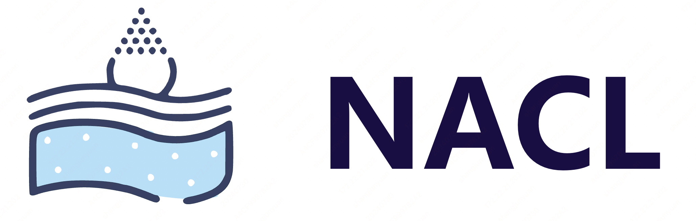

<div align="center">
  
  <br />
  <br />

# [NACL: A General and Effective KV Cache Eviction Framework for LLMs at Inference Time](https://chenyilong.cn/assets/nacl.pdf)
   <a href="https://huggingface.co/meta-llama/Meta-Llama-3.1-8B-Instruct" target="_blank">
      
   </a>
   <a href="https://github.com/OpenBMB/InfiniteBench" target="_blank">
      
   </a>
  <a href="https://github.com/PaddlePaddle/Paddle/blob/develop/python/paddle/nn/functional/flash_attention.py#L1256" target="_blank">
      
   </a>
  <a href="https://chenyilong.cn/assets/nacl.pdf" target="_blank">
      
   </a>
  <a href="https://2024.aclweb.org/" target="_blank">
      
   </a>
</div>

## 📖 Introduction
Welcome to NACL, a general and effective KV cache eviction framework for LLMs, requires no additional training. NACL can be easily integrated into existing LLMs, such as Meta-Llama, largely reducing KV Cache by up to 5x with minor performance loss. The official repository contains the code for our ACL2024 paper.

## 🌟 Features
- 🚀**General KV cache eviction framework**
  - **Progressively layer-by-layer eviction** to progressively release the memory usage of previous layers during eviction.
  - **Global optimal one eviction** among the whole encoding input to avoid the computational overhead of *one-token-in one-token-out eviction*.
  - **Head-wise eviction** to introduce more diversity for improved generalization.
- 💡**Two effective eviction policy in NACL**
  - **Proxy token eviction** utilize a small portion of task-specific tokens for identifying pivotal tokens.
  - **Random eviction** randomly sampling some tokens to be evicted to relieve biased attention scores and promote more robustness.
- 🔥**Open-sourced implementation**
  - Support the latest Meta-Llama 3.1 model[^1].
  - Support the challenging InfiniteBench-128K[^2].
  - Support FlashAttention-2 to return the attention score.
  - Support multi-GPU inference.


## 📌 How to run locally

### 🗃️ Clone the repository
```
git clone https://github.com/PaddlePaddle/Research.git
cd Research/NLP/ACL2024-NACL
```

### 🛠️ Requirements
```shell
# initialize conda env
conda create -n NACL python=3.9
conda activate NACL
# install paddlepaddle-gpu with customized NACL's kernel for FlashAttention-2
wget https://paddle-whl.bj.bcebos.com/nightly/cu118/paddlepaddle-gpu/paddlepaddle_gpu-3.0.0.dev20240722-cp39-cp39-linux_x86_64.whl
pip install paddlepaddle_gpu-3.0.0.dev20240722-cp39-cp39-linux_x86_64.whl
# install paddlenlp
pip install --pre --upgrade paddlenlp -f https://www.paddlepaddle.org.cn/whl/paddlenlp.html
# install other requirements
pip install -r requirements.txt

```

### 📚 How to Download Data

Download the dataset the `data` folder. The data folder structure should be as follows.

```shell
bash scripts/download_dataset.sh
```

This will directly dump the data to `data`.

```
ACL2024-NACL
├── data
│   ├── code_debug.jsonl
│   ├── code_run.jsonl
│   ├── kv_retrieval.jsonl
│   ├── longbook_choice_eng.jsonl
│   ├── longbook_qa_chn.jsonl
│   ├── longbook_qa_eng.jsonl
│   ├── longbook_sum_eng.jsonl
│   ├── longdialogue_qa_eng.jsonl
│   ├── math_calc.jsonl
│   ├── math_find.jsonl
│   ├── number_string.jsonl
│   ├── passkey.jsonl
│   └── construct_synthetic_dataset.py
...
```

### 📈 How to Eval
To evaluate the LLama3.1-8B model with 128K input, a single A100/A800 80GB GPU is required.

**In the `src` folder**, execute:

#### Single GPU Eval

```shell
# eval all task
python eval_llama3.py --enable_nacl_evict --task all

# eval single task
python eval_llama3.py --enable_nacl_evict --task longbook_choice_eng
```

#### Multi GPUs Eval

```shell
# eval all task
python -m paddle.distributed.launch --gpus 0,1,2,3,4,5,6,7 eval_llama3.py --enable_nacl_evict --task all

# eval multi task
python -m paddle.distributed.launch --gpus 0,1 eval_llama3.py --enable_nacl_evict --task longbook_choice_eng,longdialogue_qa_eng
```

To test the strategy without using NACL eviction, please remove `--enable_nacl_evict`.

#### Compute Scores
```
python compute_scores.py --task all

or

python compute_scores.py --task longbook_choice_eng

```

The available tasks are:

| Task Name        | Argument to specify in `--task` |
| ---------------- | ------------------------------- |
| En.Sum           | longbook_sum_qa                 |
| En.QA            | longbook_qa_eng                 |
| En.MC            | longbook_choice_eng             |
| En.Dia           | longdialogue_qa_eng             |
| Zh.QA            | longbook_qa_chn                 |
| Code.Debug       | code_debug                      |
| Code.Run         | code_run                        |
| Math.Calc        | math_calc                       |
| Math.Find        | math_find                       |
| Retrieve.PassKey | passkey                         |
| Retrieve.Number  | number_string                   |
| Retrieve.KV      | kv_retrieval                    |


## 📊 Evaluation Result

| Task Name        | Lamma3.1 8B 128K | NACL(80% KVCache Eviction) |
| ---------------- | ---------------- | -------------------------- | 
| Retrieve.PassKey | 1.000              | 1.000                     | 
| Retrieve.Number  | 0.9949           | 0.9661                     | 
| Retrieve.KV*      | 0.5920            | 0.036                      | 
| En.Sum           | 0.2761           | 0.2653                     | 
| En.QA            | 0.1303           | 0.1441                     | 
| En.MC            | 0.6637           | 0.6638                     | 
| En.Dia           | 0.1700             | 0.155                      | 
| Zh.QA            | 0.1303           | 0.1257                     | 
| Code.Debug       | 0.0076           | 0.0102                     | 
| Code.Run         | 0.0125           | 0.0175                     | 
| Math.Calc        | -                | -                          | 
| Math.Find        | 0.3285           | 0.3286                     | 
| AVG.             | 0.3914           | 0.3375                     | 
| AVG. (w.o. Retrieve.KV)             | 0.3714           | 0.3676                    | 

*We found that Retrieve.KV is one of the most challeging tasks for KV cache eviction-based methods under an extremely low KV cache eviction budget, such as 20%. This result indicates that there is considerable room for analysis and improvement in related methods.


## 🔗 Citation


```bibtex
@inproceedings{nacl2024,
      title={NACL: A General and Effective KV Cache Eviction Framework for LLMs at Inference Time}, 
      author={Yilong Chen and Guoxia Wang and Junyuan Shang and Shiyao Cui and Zhenyu Zhang and Tingwen Liu and Shuohuan Wang and Yu Sun and Dianhai Yu and Hua Wu},
      booktitle={Proceedings of the 62nd Annual Meeting of the Association for Computational Linguistics (ACL)},
      year={2024},
      publisher={Association for Computational Linguistics},
      address={Bangkok, Thailand}
}
```

## References

[^1]:[The Llama 3 Herd of Models](https://scontent-itm1-1.xx.fbcdn.net/v/t39.2365-6/452387774_1036916434819166_4173978747091533306_n.pdf?_nc_cat=104&ccb=1-7&_nc_sid=3c67a6&_nc_ohc=DTS7hDTcxZoQ7kNvgFEityk&_nc_ht=scontent-itm1-1.xx&gid=AK98To87L1-SZHQ0fCh7NFy&oh=00_AYCUYV1JtufGAbl4hVwf_rmIiU11NatzvqCsYJJ6Qn03rw&oe=66AED48D)

[^2]:[$\infty $ Bench: Extending Long Context Evaluation Beyond 100K Tokens.](https://arxiv.org/abs/2402.13718)
