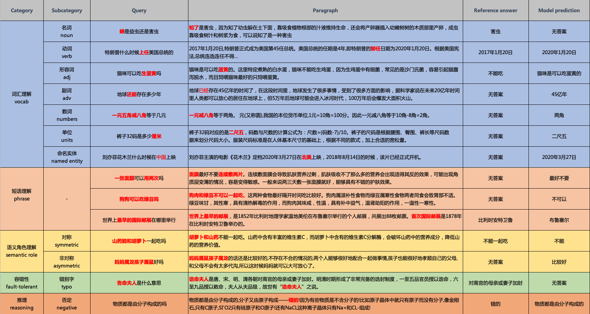

# 阅读理解 DuReader<sub>checklist</sub>

# 简介

## 1. 任务说明
机器阅读理解 (Machine Reading Comprehension) 是指让机器阅读文本，然后回答和阅读内容相关的问题。阅读理解是自然语言处理和人工智能领域的重要前沿课题，对于提升机器的智能水平、使机器具有持续知识获取的能力等具有重要价值，近年来受到学术界和工业界的广泛关注。

自然语言理解对机器学习模型各方面的能力均有极高的要求。然而，当前的机器阅读理解数据集大多都只采用单一的指标来评测模型的好坏，缺乏对模型语言理解能力的细粒度、多维度评测，导致模型的具体缺陷很难被发现和改进。为了解决这个问题，我们建立了细粒度的、多维度的评测数据集，从词汇理解、短语理解、语义角色理解、逻辑推理等多个维度检测模型的不足之处，从而推动阅读理解评测进入“精细化“时代。

## 2. 数据集
DuReader<sub>checklist</sub>数据集旨在通过建立checklist评测体系，系统性地评估当前模型能力的不足之处。目前checklist体系中涉及到的自然语言理解能力包含：词汇理解、短语理解、语义角色理解以及推理能力等等。具体的分类体系可参考下图：


DuReader<sub>checklist</sub>数据集包含训练集、开发集以及测试集。其中开发集和测试集中，既包含和训练集同分布的in-domain样本，也包含了按照checklist体系分类后的样本。对于一个给定的问题q、一个篇章p及其标题t，系统需要根据篇章内容，判断该篇章p中是否包含给定问题的答案，如果是，则给出该问题的答案a；否则输出“no answer”。数据集中的每个样本，是一个四元组<q, p, t, a>，例如：

* * *

**问题 q**: 番石榴汁热量

**篇章 p**: 番石榴性温,味甜、酸、涩…，最重要的是番石榴所含的脂肪热量较低,一个番石榴所含的脂肪约0.9克重或84卡路里。比起苹果,番石榴所含有的脂肪少38%,卡路里少42%。

**标题 t**: 番石榴汁的热量 - 妈妈网百科


**参考答案 a**: [‘一个番石榴所含的脂肪约0.9克重或84卡路里’]

* * *

**问题 q**: 云南文山市多少人口?

**篇章 p**: 云南省下辖8个市、8个少数民族自治州,面积39万平方千米,总人口4596万人,云南汉族人口为3062.9万人,占云南省总人口的66.63%...

**标题 t**: 云南总人口数多少人,2019年云南人口数量统计(最新)


**参考答案 a**: [‘无答案’]

* * *


# 快速开始

### 安装说明

* PaddlePaddle 安装

   本项目依赖于 PaddlePaddle 2.0 及以上版本，请参考 [安装指南](http://www.paddlepaddle.org/#quick-start) 进行安装

* PaddleNLP 安装

   ```shell
   pip install --upgrade paddlenlp -i https://pypi.org/simple
   ```

* 环境依赖

    Python的版本要求 3.6+

### 目录结构

```text
├── README.md               # 说明文档
├── evaluate.py             # 评测脚本
├── run_eval.sh             # 评测入口
├── train.sh                # 训练入口
├── predict.sh              # 预测入口
├── src/run_du.py           # 训练、预测逻辑  
├── src/squad.py            # reader、后处理等
├── src/args.py             # 超参配置
├── src/models.py           # 模型
```


### 数据准备
在运行基线之前，需要下载DuReader<sub>checklist</sub>数据集，运行

```
sh download.sh
```

该命令完成之后，数据集会被保存到```dataset/```文件夹中。此外，基于[ERNIE-1.0](https://arxiv.org/abs/1904.09223)微调后的基线模型参数也会被保存在`finetuned_model/ `文件夹中，可供直接预测使用。

### 模型训练

* 按如下方式可以使用默认配置进行训练，并在开发集做预测:

```
sh train.sh
```
其中训练好的模型参数以及预测结果会被保存在`output/`件夹中。

* 如需使用其他数据集进行数据增强 (例如[DuReader<sub>robust</sub>](https://github.com/PaddlePaddle/Research/tree/master/NLP/DuReader-Robust-BASELINE)训练集)，可以使用以下命令 (数据格式需保持兼容):

```
sh train.sh --train_file path_to_dataset_file
```
其中`path_to_dataset_file `是数据集路径，例如`dataset/train.json`。

* 如需使用前一阶段训练好的参数进行热启动训练，可运行以下命令：

```
sh train.sh --model_name_or_path path_to_model_ckpt
```
其中`path_to_model_ckpt`是模型参数路径，例如`output/model_2000`。

更为详细的参数配置可参考`train.sh`以及`args.py`。


### 模型预测
* 如需使用训练好的参数进行预测，可参考以下命令：

```
sh predict.sh --model_name_or_path path_to_model_ckpt --predict_file  path_to_dataset_file
```
其中`path_to_model_ckpt`是模型参数路径，`path_to_dataset_file `是数据集路径。

* 为了方便测试，我们也提供了已经微调好的模型参数。运行以下命令即可直接进行预测

```
sh predict.sh --model_name_or_path finetuned_model --predict_file dataset/dev.json
```
预测结果会被保存在`output/`件夹中。

### 结果评估
评估脚本的运行参考以下命令:

```
sh run_eval.sh dataset_file pred_file
```

其中`dataset_file `是数据集文件，`pred_file`是模型预测结果，例如

```
sh run_eval.sh dataset/dev.json output/dev_predictions.json
```
下表是ERNIE-1.0基线模型在dev集合的效果:

| Dataset | Num_examples | F1 | EM |
| --- | :---: | --- | --- |
| All | 1130 | 64.080 | 55.221 |
| in-domain | 1000 |65.809 | 57.000 |
| vocab | 35 | 44.113 |42.857 |
| phrase | 35 | 63.345 | 62.857 |
|semantic-role | 20 | 41.827 | 25.000 |
|fault-tolerant | 20 | 46.741 | 25.000 |
|reasoning| 20 | 53.429 | 35.000 |


# 其他

## 如何贡献代码

如果你可以修复某个issue或者增加一个新功能，欢迎给我们提交PR。如果对应的PR被接受了，我们将根据贡献的质量和难度进行打分（0-5分，越高越好）。如果你累计获得了10分，可以联系我们获得面试机会或者为你写推荐信。
