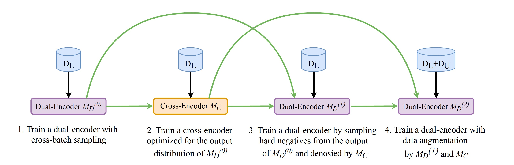

# RocketQA
This is a repository of the paper: [RocketQA: An Optimized Training Approach to Dense Passage Retrieval for Open-Domain Question Answering](https://arxiv.org/pdf/2010.08191.pdf), NAACL 2021. 

## Introduction
RocketQA is an optimized training approach to improving dense passage retrieval. The three major technical contributions include cross-batch negatives, denoised hard negative sampling and data augmentation. 
The experiment results show that RocketQA significantly outperforms previous state-of-the-art models on both MSMARCO and Natural Questions (NQ), and the performance of end-to-end QA can be improved based on RocketQA retriever.  
The pipeline of RocketQA training approach is shown as follows:


## Preparation
### Environment
* Python 3.7
* PaddlePaddle 1.8 (Please refer to the [Installation Guide](http://www.paddlepaddle.org/#quick-start)) 
* cuda >= 9.0  
* cudnn >= 7.0
* Faiss
### Download data
To download the raw corpus of MSMARCO & NaturalQuestions, as well as the preprocessed training data, run
```
sh wget_data.sh
```
The downloaded data will be saved into <u>`corpus`</u> (including the training and development/test sets of MSMARCO & NQ, all the passages in MSMARCO and Wikipedia to be indexed, and an unlabeled query dataset), <u>`data_train`</u> (including the preprocessed training data for step 1, step 3 and step 4 of RocketQA).
```
├── corpus/
│   ├── marco                   # The original dataset of MSMARCO 
│   │   ├── train.query.txt
│   │   ├── qrels.train.tsv
│   │   ├── qrels.train.addition.tsv    # Some positive samples were added through literal matching
│   │   ├── dev.query.txt
│   │   ├── qrels.dev.tsv
│   │   ├── para.txt
│   │   ├── para.title.txt
│   │   ├── para_8part          # The paragraphs were divided into 8 parts to facilitate the inference
│   │   ├── 
│   ├── nq                      # The original dataset of NQ 
│   │   ├── ...                 # (has the same directory structure as MSMARCO) 
│   ├── augment                 # Unlabeled queries from three public datasets (after some filtering operations)
│   │   ├── mrqa.query.txt
│   │   ├── orcas_yahoo_nq.query.txt
│   │   ├── yahoo_query_clean.txt
```

```
├── data_train/
│   ├── marco_de0_denoise.tsv                   # Training examples for step 1, negatives are randomly sampled from whole MSMARCO corpus
│   ├── marco_de1_denoise.tsv                   # Training examples denoised by cross-encoder on MSMARCO (for step 3)
│   ├── marco_merge_de2_denoise.tsv             # Merged with unlabeled examples on MSMARCO (for step 4)
│   ├── nq_de0_denoise.tsv                      # Training examples for step 1, negatives are randomly sampled from DPR's candidates(ES top100)
│   ├── nq_de1_denoise.tsv                      # Training examples denoised by cross-encoder on NQ (for step 3)
│   ├── nq_merge_de2_denoise.tsv                # Merged with unlabeled examples on NQ (for step 4)
```
### Download the trained models
To download our trained models and the initial pre-trained language model (ERNIE 2.0), run
```
sh wget_trained_model.sh
```
The downloaded model parameters will be saved into <u>`checkpoint`</u>, including
```
├── checkpoint/   
│   ├── ernie_large_en                           # (ERNIE 2.0 large) initial parameters for cross-encoder 
│   ├── ernie_base_twin_init                     # (ERNIE 2.0 base) initial parameters for dual-encoder
│   ├── marco_dual_encoder_v0                    # Dual-encoder model on MSMARCO (MD0 of step 1)
│   ├── marco_cross_encoder_large                # Cross-encoder model on MSMARCO (MC of step 2)
│   ├── marco_dual_encoder_v2                    # Dual-encoder model on MSMARCO (MD2 of step 4, the final model)
│   ├── nq_cross_encoder_large                   # Cross-encoder model on NQ (MC of step 2)
│   ├── nq_dual_encoder_v2                       # Dual-encoder model on NQ (MD2 of step 4, the final model)
```
For a quick start, we also provide the models trained in the first two steps of the RocketQA training pipeline, and you can directly start the experiments from the third step. 


## Training
### Data processing
The training pipeline of RocketQA consists of four steps, as described in Section 4.3 in paper. The training instances for each step are different. Here, we provide the scripts to construct the training instances of MSMARCO and NQ in each step, respectively.  

*In our implementation to training dual-encoder models, each instance contains 1 query with 1 positive passage and 1 hard negative passage.* 

- For MSMARCO:  
    - Step 1: In this step, we construct the training data for first duel-encoder model (M<sub>D</sub><sup>(0)</sup>). *In our implementation, to keep the consistency with the step 3 and step 4, we add 4 negative passages randomly sampled from all candidate passages for each query, although there is no hard negative in this step.*
   
    - Step 2: In this step, we construct the training data for cross-encoder (MC). First, we retrieve the top K passages for each training query by M<sub>D</sub><sup>(0)</sup> (<u>`$recall_topk_file`</u>, file format: qid \t pid \t rank \t score). Then, we can obtain the training data by running the following command:
        ```
        python construct_marco_train_ce.py $recall_topk_file $output_file
        ```
    - Step 3: In this step, we construct the training data for dual-encoder with hard negative denoising. First, we use cross-encoder M<sub>C</sub> to score the top K retrieved passages, and obtain <u>`$ce_score_topN_file`</u> (file format: a score in each line). Then, we can obtain the training data by running the following command: 
        ```
        python construct_marco_train_de.py $recall_topk_file $ce_score_topN_file $output_file
        ```
    - Step 4: In this step, we construct the training data for data augmentation. First, we retrieve the top K passages of unlabeled queries on MSMARCO corpus by dual-encoder M<sub>D</sub><sup>(1)</sup> (<u>`$recall_topk_file`</u>), and then score the query-paragraph pair by cross-encoder M<sub>C</sub> (<u>`$ce_score_topN_file`</u>). We can obtain the augmentation data by running the following command: 
        ```
        python construct_unlabel_train_de.py $recall_topk_file $ce_score_topN_file $output_file marco
        ```
        Then, we need to merge augmentation data with training data in step 3 to get final training data for step 4.  

- For NQ, the procedure of processing training data is the same as MSMARCO (except for step 1): 
    - Step 1: We directly use the training data released by [DPR](https://github.com/facebookresearch/DPR), which contains hard negatives sampled from top-100 passages retrieved by BM25. 
    - Step 2: 
        ```
        python construct_nq_train_ce.py $recall_topk_file $output_file
        ```
    - Step 3:
        ```
        python construct_nq_train_de.py $recall_topk_file $ce_score_topN_file $output_file 
        ```
    - Step 4: 
        ```
        python construct_unlabel_train_de.py $recall_topk_file $ce_score_topN_file $output_file nq
        ```

### Dual-encoder training
To train a dual-encoder model, run
```
cd model
sh script/run_dual_encoder_train.sh $TRAIN_SET $MODEL_PATH $epoch $nodes
```

### Dual-encoder inference
To do the inference of dual-encoder and get top K retrieval results (retrieved by FAISS), run
```
sh script/run_retrieval.sh $TEST_SET $MODEL_PATH $DATA_PATH $TOP_K
```
Here, we separate whole candidate passages into 8 parts, and predict their embeddings with 8 GPU cards simultaneously. After getting top K results on each part, we merge them to get the final file. (ie. <u>`$recall_topk_file`</u> in Data Processing)

### Cross-encoder training
To train a cross-encoder model, run
```
sh script/run_cross_encoder_train.sh $TRAIN_SET $MODEL_PATH $epoch $node
```

### Cross-encoder inference
To get the predicted scores of topN query-paragraphs pair (ie. <u>`$ce_score_topN_file`</u> in Data Processing), run
```
sh script/run_cross_encoder_test.sh $TEST_SET $MODEL_PATH
```

### The Training Procedure
To reproduce the results of the paper, you can follow the commands in **```run_marco.sh```** / **```run_nq.sh```**. These scripts contain the entire process of RocketQA. Each step depends on the result of the previous step. Since we have provided the processed training data and trained models, you can start from any step.

Tips: remember to specify GPU cards before training by
```
export CUDA_VISIBLE_DEVICES=0,1,xxx
```

## Evaluation
To evaluate the models on MSMARCO development set, run
```
python metric/msmarco_eval.py corpus/marco/qrels.dev.tsv $recall_topk_file
```
To evaluate the models on NQ test set, run
```
python metric/nq_eval.py $recall_topk_file
```
The table below shows the results of our experiments in different steps of RocketQA training pipeline.  
<table>
<tr>
<th rowspan="2">Model</th><th colspan="3">MSMARCO Dev</th><th colspan="3">NQ Test</th>
</tr>
<tr>
<th>MRR@10</th><th>R@50</th><th>R@1000</th><th>R@5</th><th>R@20</th><th>R@100</th>
</tr>
<tr>
<td>Dual-encoder M<sub>D</sub><sup>(0)</sup></td><td>33.32</td><td>83.95</td><td>97.21</td><td>68.89</td><td>80.83</td><td>87.40</td>
</tr>
<tr>
<td>Dual-encoder M<sub>D</sub><sup>(1)</sup></td><td>36.38</td><td>84.63</td><td>97.44</td><td>73.16</td><td>83.10</td><td>88.64</td>
</tr>
<tr>
<td>Dual-encoder M<sub>D</sub><sup>(2)</sup></td><td>37.02</td><td>85.46</td><td>97.85</td><td>73.32</td><td>83.38</td><td>88.64</td>
</tr>
</table>

*The result of the last step on NQ might be slightly different from the result reported in the paper, because we lost the original model file. We re-train the model and provide the corresponding checkpoint.*

## Passage Reading
We also examine that the retrieval results of RocketQA can improve the performance of passage reading for extracting correct answers. We use the implementation of extractive reader published in [DPR](https://github.com/facebookresearch/DPR). We first reuse the released reader model of DPR, and take 100 retrieved passages during inference (the same setting used in DPR), which achieve 42.0 EM.  Besides, we use the same setting to train a new extractive reader based on the retrieval results of RocketQA (except that we choose top 50 passages for training instead of 100). After reconstructing the training data and retraining the reader, we get a result of 42.8 EM.  

## Citation
If you find our paper and code useful, please cite the following paper:
```
@inproceedings{qu2021rocketqa,
  title={RocketQA: An optimized training approach to dense passage retrieval for open-domain question answering},
  author={Qu, Yingqi and Ding, Yuchen and Liu, Jing and Liu, Kai and Ren, Ruiyang and Zhao, Wayne Xin and Dong, Daxiang and Wu, Hua and Wang, Haifeng},
  booktitle={Proceedings of the 2021 Conference of the North American Chapter of the Association for Computational Linguistics: Human Language Technologies},
  pages={5835--5847},
  year={2021}
}
```

## Contact Information
For help or issues using RocketQA, please submit a GitHub issue.
For other communications related to RocketQA, please contact Yingqi Qu (quyingqi@baidu.com), Jing Liu (liujing46@baidu.com).
