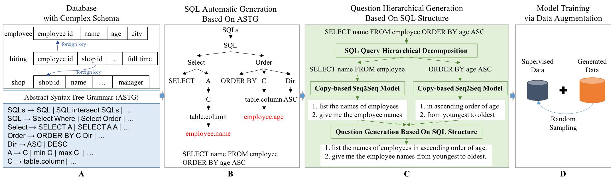

Text2sql DA HIER
===
Code for EMNLP2021 accepted paper "[Data Augmentation with Hierarchical SQL-to-Question Generation for Cross-domain Text-to-SQL Parsing](https://aclanthology.org/2021.emnlp-main.707/)". Our framework is shown as follows:



---
## Environment
    
    python == 3.6

install nltk package

    pip3 install nltk

Other requirements refers to [OpenNMT](https://github.com/OpenNMT/OpenNMT-py) and different parsers.

<!-- Packages

    sh installs.sh -->

## Stage A & B: generate SQL and sub-SQLs

    python3 -c "import nltk;nltk.download('punkt')"

    cd clause2subquestion

### download db content
download db_content.json from https://aistudio.baidu.com/aistudio/datasetdetail/130021 , and put db_content.json under clause2subquestion/auto_gen/

### gengerate sub-SQLs
generate SQL and sub-SQLs. The generated file clause_aug.json can be found under spider/

    cd auto_gen
    sh gen.sh

## Stage C: Question Generation
### model training

We trained our model with OpenNMT: https://github.com/OpenNMT/OpenNMT-py

We do our experiments with version v1.1.1.

### generate data for training and pediction

    # get sub-sql and sub-question
    cd clause2subquestion
    python data.py # training data


    # get source data of augmentation
    cd spider
    python aug2src.py # augment data


### prediction and compose the question

Details refer to https://github.com/OpenNMT/OpenNMT-py.
After get the sub-question for each sub-SQL, we need to compose the full question.

    #question composition from aug_src.txt, aug_tgt.txt and clause_aug_sample.json, then output generated question-SQL dataset aug_output.json
    python tgt2question.py

Our generated data for Spider can be found at https://aistudio.baidu.com/aistudio/datasetdetail/123584 .


## Stage D: Parser training

We did our Spider experiments based on parsers([IRNet](https://github.com/microsoft/IRNet), and [RAT-SQL](https://github.com/Microsoft/rat-sql)).


<!-- 
### RATSQL
#### download bert model

    cd parsers/RAT-SQL
    sh bert_download.sh

#### data preprocess

    mkdir data && cd data 

#### you can download part of our preprocessed data from https://aistudio.baidu.com/aistudio/datasetdetail/120901/0 and put in the director data/spider/

#### please download and unzip Spider dataset form url(https://yale-lily.github.io/spider). 

```
data
├── spider
|── |── nl2code,output_from=true,fs=2,emb=bert,cvlink
    ├── database
    │   └── ...
    ├── dev.json
    ├── dev_gold.sql
    ├── tables.json
    ├── train_gold.sql
    ├── train_others.json
    └── train_spider.json
```

#### Details of our baseline model refer to https://github.com/Microsoft/rat-sql. You can download codes director ratsql/ and put in parsers/RAT-SQL, and add key codes in parsers/RAT-SQL/readme.md

#### Train with augmented data

    export CUDA_VISIBLE_DEVICES=0 # device index
    nohup python -u run.py train experiments/experiments/spider-label-smooth-bert-large-run.jsonnet >aug.log &2>1 &

Alternatively, you can choose a train strategy betwwen aug and naive by changing the key named train_mode

#### Evaluation

    export CUDA_VISIBLE_DEVICES=0 # device index
    nohup python run.py eval experiments/experiments/spider-label-smooth-bert-large-run.jsonnet > eval_step10-40.log &2>1 &

we will save our model every 1k steps. It is neccessary to evaluate every model by assigning steps of eval_steps in configuation file experiments/experiments/spider-label-smooth-bert-large-run.jsonnet.
The output file eval_step10-40.log logs the models' performance for certain steps. And our evaluation results are in the folder: eval_logs -->
#### Tips

<!-- Because of the unstability of RAT, "double descent" phenomenon could happen.
It is required to change the random seed(att) in parsers/RAT-SQL/experiments/spider-label-smooth-bert-large-run.jsonnet, and modify the director name in logdir and soft linking "model_checkpoint".
And then we can load the pretrained model and retrain it. -->
Issue details can be found in issues of github repo(https://github.com/Microsoft/rat-sql).
